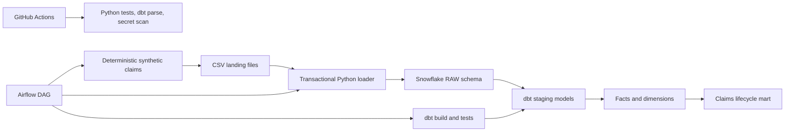

# Architecture and control flow

Airflow owns ordering, retries, timeout behavior, and the freshness gate. dbt
owns transformations, model dependencies, documentation, and data tests.
Snowflake owns durable raw/analytics storage and elastic compute. GitHub Actions
validates code without contacting Snowflake; live integration remains an
explicit local step so repository forks cannot consume trial credits.

## Trust boundaries

- Synthetic data only; no employer, customer, or personal data.
- Secrets enter through environment variables and are excluded from Git.
- Loader and transformer permissions are separated in the bootstrap SQL.
- The success notification is local and intentionally contains no claim data.
